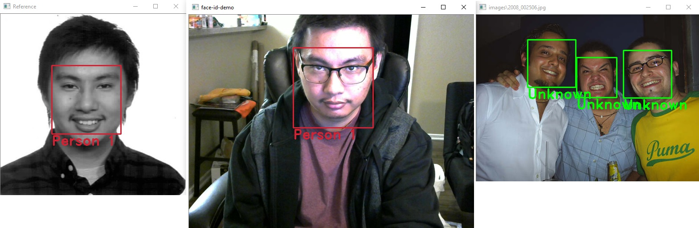
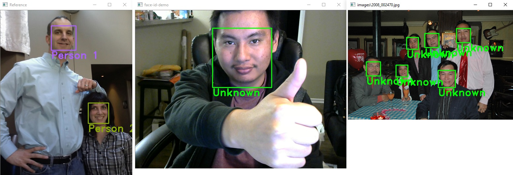
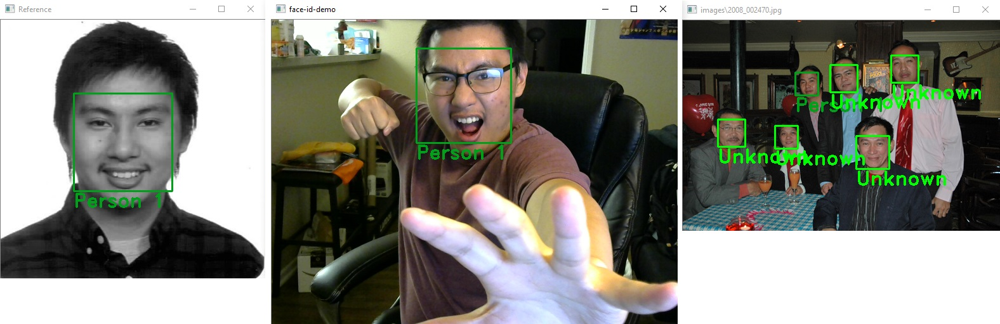

# face-id-demo

A program that provides a demo for facial recognition using dlib and OpenCV.

## Overview

Using OpenCV to capture data from a webcam, you can capture a photo of yourself to be used for your facial identification. Then, you are allowed to take more pictures of yourself to be included in the demo. Once you are satisfied with your photoshoot, the program will sift through an images directory to detect faces and predict whether they are you or not. Also, a real time demo version is available. Calibrate with multiple people in front of the webcam and their faces will be tracked.

## Environment

My environment used to develop this project:

- Ubuntu 18.04.1
- Python 2.7.15rc1
- dlib 19.16.99
- OpenCV 3.2.0
- NumPy 1.15.2

I believe the only dependencies here would be Python, dlib, OpenCV and NumPy

## Usage

First, make sure you have an `images` directory where you can store images to be used in the demo. You do not need this for the real time demo.

You can download the appropriate models needed from dlib here:
- http://dlib.net/files/shape_predictor_5_face_landmarks.dat.bz2
- http://dlib.net/files/dlib_face_recognition_resnet_model_v1.dat.bz2

The program assumes you have the above models in a directory named `models` and the images are in the `images` directory. Make adjustments in the code if necessary.

Now, run the program with: `./main.py`

Throughout the entirety of the program, pressing the 'q' key will exit the program.

At this point, data from your usb webcam should pop up. If not, then try changing the `1` in `cap = cv.VideoCapture(1)` to `0` or vice versa. I initally needed 1 because my laptop has a built-in webcam, which I do not want to use.

When you are ready to take a picture of yourself, press 'c' on your keyboard to use that picture to compute your facial identification. The webcam feed will most likely freeze (on light hardware); that's normal, it is now computing your id.

Then, once it is done you are allowed to take additional photos of yourself to be included in the demo. Once you are satisfied with your photoshoot, press the 'p' key to start the demo.

The program should then iterate through all of your .jpg images in the `images` directory, detecting faces and making a prediction to whether that face is yours or not. Green bounding boxes are a match and red bounding boxes are not a match. Press the 'n' key to move on to the next image.

Once that is done, you will be returned to the start of the program where you can then use another face to be used for this demo. Note that at this point your photoshoot photos are deleted.

Quitting the program with the 'q' key will also delete any of your photoshoot photos before exiting the program.

For the real time demo: `./real_time_demo.py`

When calibrating an image with faces in it, each person is associated with a random color to help distinguish between identifications during the demo. Any unknown faces will be shown in bright green.

And the controls are pretty similar to above; 'c' to calibrate and 'q' to quit. Additionally you can reset the calibration with the 'r' key.

Also, you are able to provide an image to be used for calibration instead of from the webcam. Pass the path to the image as an argument to do so.

Additonally, any more images you would like to process can be passed after the first argument.

## Examples

From left to right: first window shows the image that was used for calibration (the reference), second window shows the feed from the webcam, and the third window is an image from disk.

Here are some examples with a false positive

